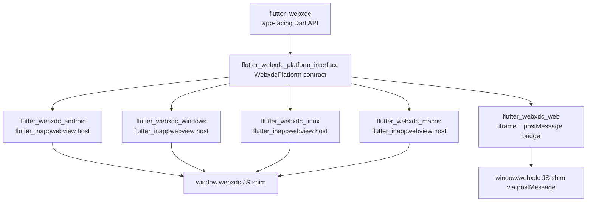

# flutter_webxdc — Design

This document records the target architecture for `flutter_webxdc`, a Flutter
plugin implementing the [webxdc specification](https://webxdc.org/docs/spec/index.html)
for interactive, embeddable mini apps (`.xdc` archives) exchanged over
chat-like transports. It follows the guidance in `AGENTS.md`: the public Dart
API stays platform-agnostic, platform hosting is split out using the
federated-plugin pattern, and intentional spec deviations are recorded here.

This is a living design document. It is being filled in incrementally, one
delivery step at a time (see the project plan); sections not yet covered are
marked `TODO (Step N)` below.

## 1. Spec summary

The [webxdc specification](https://webxdc.org/docs/spec/index.html) defines
how mini apps are packaged, delivered, and run, and covers three areas:

1. **`.xdc` container file format** — a zip file containing a `manifest.toml`,
   an optional icon, and static web assets (HTML/JS/CSS) that make up the
   mini app.
2. **JavaScript API** (`window.webxdc`) — a minimal, stable API that all mini
   apps can rely on to send/receive status updates, request files, learn the
   local user's chat identity, and (experimentally) exchange realtime data
   with peers.
3. **Messenger implementation requirements** — how a hosting messenger (in
   our case, any Flutter app embedding this plugin) must run mini apps inside
   an isolated web view, deliver `sendUpdate` payloads to peers, and persist
   per-app state across restarts.

`flutter_webxdc` implements areas (1) and (2) as a reusable Flutter
plugin, and provides the primitives a host application needs to fulfil area
(3) — see [§4 Update/sync model](#4-updatesync-model-plugin-vs-host-boundary)
for the precise boundary.

## 2. Target federated package layout

Per `AGENTS.md`, once the implementation grows beyond a single-file skeleton
we adopt the **federated plugin pattern** instead of branching on platform
inside shared code. The agreed target layout (single Git repo, melos-style
workspace) is:



| Package                            | Responsibility                                                                                                                                   |
| ----------------------------------- | -------------------------------------------------------------------------------------------------------------------------------------------------|
| `flutter_webxdc`                    | App-facing Dart API: widgets/controllers a host app uses to open/host a `.xdc`, `WebxdcManifest` parsing, `.xdc` zip reading. Platform-agnostic. |
| `flutter_webxdc_platform_interface` | Abstract `WebxdcPlatform` contract (method-channel/JS message shapes), `WebxdcUpdate` model, shared test doubles. No platform code.               |
| `flutter_webxdc_android`            | Android implementation, hosts `.xdc` content in a `flutter_inappwebview` `InAppWebView`, injects `window.webxdc` via `addJavaScriptHandler`.      |
| `flutter_webxdc_linux` / `_macos` / `_windows` | Desktop implementations, same `flutter_inappwebview` approach as Android (its desktop WebView backends expose the same JS-bridge API).|
| `flutter_webxdc_web`                | Web implementation: hosts `.xdc` assets in a sandboxed `<iframe>`, bridges `window.webxdc` via `postMessage` (`dart:js_interop`/`package:web`), since there is no WebView to embed a JS handler into. |

**Note on current repository state:** the repository is still a single
plain Dart/Flutter package skeleton (`pubspec.yaml` has no `flutter: plugin:`
section, `lib/flutter_webxdc.dart` only has a placeholder `Calculator`
class). The federated-package split above is the *target* architecture to
migrate to as the platform-hosting code is implemented in a follow-up task;
this task only records the decision and does not scaffold the packages.

### WebView technology decision: `flutter_inappwebview`

We choose [`flutter_inappwebview`](https://pub.dev/packages/flutter_inappwebview)
over `webview_flutter` plus assorted desktop add-ons because it:

- exposes a single, consistent JS-bridge API (`addJavaScriptHandler` /
  `evaluateJavascript`) across Android, Windows, Linux, and macOS — this is
  exactly what's needed to inject `window.webxdc` and intercept
  `sendUpdate`/`importFiles` calls uniformly across those four platforms;
- supports the content-security and isolation controls (custom URL schemes,
  disabling arbitrary network access, restricting navigation) needed to
  enforce the sandboxing requirements in [§3](#3-sandboxing--security-requirements).

Flutter Web cannot embed a native WebView at all, so `flutter_webxdc_web`
uses a sandboxed `<iframe>` with a `postMessage`-based bridge instead (see
[§3](#3-sandboxing--security-requirements) for why its sandboxing is weaker).

### 2.1 JS API contract (`window.webxdc`)

The table below is the implementable contract between the mini app's JS and
the Dart platform-interface layer. "Direction" is from the mini app's point
of view: **JS→Dart** means the mini app calls into the plugin (which may in
turn call the host app); **Dart→JS** means the plugin/host supplies a value
that is injected into `window.webxdc` for the mini app to read.

| Member | Direction | Signature / payload shape | Notes |
| ------ | --------- | -------------------------- | ----- |
| `sendUpdate(update, descr)` | JS→Dart | `update: { payload: JSONValue, info?: string, document?: string, summary?: string, href?: string, notify?: { [addr: string]: string } }`, `descr: string` (deprecated fallback used as `info`/chat-message text on older messengers) | `payload` MUST be JSON-serializable (no `undefined`, no binary buffers — base64-encode files). `notify` maps user addresses to notification text; the special `"*"` key is used as a catch-all when `selfAddr` is not present. `info` is truncated to ~50 chars, `document` to ~20 chars, both must not contain line breaks. Rate/size-limited by `sendUpdateInterval`/`sendUpdateMaxSize` below. Forwarded verbatim to the host app (see [§4](#4-updatesync-model-plugin-vs-host-boundary)). |
| `setUpdateListener(callback, serial)` | JS registers, Dart→JS delivers | `callback: (update: WebxdcUpdate) => void`, `serial: number` (defaults to `0`) | Delivers every update with a serial greater than the given one, including updates sent by the local instance itself, replayed in order. Returns a `Promise<void>` that resolves once the backlog known at call time has been delivered. Calling it more than once is undefined behavior (only the last registration must be honored, matching upstream implementations). |
| `sendUpdateInterval` | Dart→JS (property) | `number` (milliseconds) | Minimum time the mini app should wait between `sendUpdate()` calls; default `10000` if the host doesn't override it. Advisory — the platform layer may coalesce/delay updates sent faster than this. |
| `sendUpdateMaxSize` | Dart→JS (property) | `number` (bytes) | Maximum serialized size of a single `update` object; default `128000`. The plugin should reject/report oversized `sendUpdate` calls rather than silently truncating. |
| `sendToChat(payload)` | JS→Dart | `payload: { file?: { name: string, blob: Blob /* base64 over the bridge */ , contentType?: string }, text?: string }` (at least one of `file`/`text` required) | Opens the host chat's compose/share UI pre-filled with the given file/text so the user can forward it as a regular chat message (distinct from `sendUpdate`, which is peer-sync data). Returns a `Promise<void>`. |
| `importFiles(filters)` | JS→Dart | `filters: { extensions?: string[], mimeTypes?: string[], multiple?: boolean }` → returns `Promise<File[]>` | Triggers the platform's native file picker; `multiple` defaults to `false`. Selected files are read back into the sandbox as `File` objects — no direct filesystem access is exposed. |
| `selfAddr` | Dart→JS (property) | `string` | Opaque, host-supplied pseudonymous address identifying the local user *within this chat*; not necessarily the user's real chat address. Supplied per app instance by the host application (see [§4](#4-updatesync-model-plugin-vs-host-boundary)). |
| `selfName` | Dart→JS (property) | `string` | Host-supplied display name for the local user; hosts that don't track a name should provide `"unknown"` rather than omitting the property. |
| `joinRealtimeChannel()` *(experimental)* | JS→Dart | Returns a `realtimeChannel` object: `{ setListener(cb: (data: Uint8Array) => void): void, send(data: Uint8Array): void, leave(): void }` | Optional/feature-detected (`window.webxdc.joinRealtimeChannel !== undefined`); see [§6](#6-open-questions--limitations). `send()` payloads are capped at `128000` bytes and MUST be `Uint8Array`; data is ephemeral (not persisted/replayed like `sendUpdate`). |

`webxdc.js` itself (the script that defines `window.webxdc`) is injected by
the **host messenger**, never bundled inside the `.xdc` file — each platform
package (`flutter_webxdc_android`, `_web`, …) is responsible for injecting an
equivalent shim that forwards these calls to the `WebxdcPlatform` contract in
`flutter_webxdc_platform_interface`.

### 2.2 `manifest.toml` schema and `WebxdcManifest` data model

Every `.xdc` zip MUST contain a `manifest.toml` at its root. Stable spec
fields, plus the plugin-level `*_api_version` fields the platform interface
will use for its own capability negotiation (see the caveat below the table):

| Field | Type | Required | Default | Notes |
| ----- | ---- | -------- | ------- | ----- |
| `name` | string | **required** | — | Display name of the mini app, shown next to its icon. |
| `source_code_url` | string | optional | `null` | URL to the app's source code, surfaced by hosts as a "view source" link. |
| `request_internet_access` | boolean | optional | `false` | If `true`, the web view/iframe is allowed outgoing network access (see [§3](#3-sandboxing--security-requirements)); if absent or `false`, all network requests MUST be blocked. |
| `min_api_version` | integer | optional | `null` | *Plugin-level, forward-looking field* (see caveat below) — lowest `WebxdcPlatform` API/capability version the app requires; hosts below this version should refuse to run the app rather than fail at runtime. |
| `max_api_version` | integer | optional | `null` | *Plugin-level, forward-looking field* (see caveat below) — highest API/capability version the app was tested against; informational only, hosts are not required to enforce it. |

> **Caveat:** as of this writing, the upstream stable webxdc spec
> (https://webxdc.org/docs/spec/index.html) only confirms `name`,
> `source_code_url`, and `request_internet_access` as documented
> `manifest.toml` fields; `min_api_version`/`max_api_version` are not present
> in the public spec pages we could verify. We still record them here (per
> this design's requirements) as an anticipated extension point for the
> `flutter_webxdc_platform_interface` capability contract (e.g. gating
> `joinRealtimeChannel` support), but implementations MUST treat them as
> optional/tolerant-parse fields and MUST NOT fail to load an `.xdc` app
> solely because they are absent — see also [§6](#6-open-questions--limitations).

Planned Dart data model (`flutter_webxdc`, to be implemented in a later
task):

```dart
/// Parsed representation of a `.xdc` app's `manifest.toml`.
class WebxdcManifest {
  const WebxdcManifest({
    required this.name,
    this.sourceCodeUrl,
    this.requestInternetAccess = false,
    this.minApiVersion,
    this.maxApiVersion,
  });

  /// Required. Display name of the mini app.
  final String name;

  /// Optional. URL to the app's source code.
  final String? sourceCodeUrl;

  /// Optional, defaults to `false`. Whether the app may perform outgoing
  /// network requests from its web view/iframe.
  final bool requestInternetAccess;

  /// Optional. Lowest platform-interface API version required by the app.
  final int? minApiVersion;

  /// Optional. Highest platform-interface API version the app was tested
  /// against.
  final int? maxApiVersion;

  /// Parses a `manifest.toml` document, tolerating missing optional fields.
  /// Throws a [FormatException] if `name` is missing or not a string.
  factory WebxdcManifest.fromToml(Map<String, dynamic> toml) {
    throw UnimplementedError('parser implemented in a later task');
  }
}
```

## 3. Sandboxing / security requirements

Every hosting platform implementation MUST enforce the following, per the
webxdc "messenger implementation" requirements:

- **No network access by default.** `.xdc` content is loaded from local
  bundled/extracted assets (never a live network URL), and outgoing network
  requests from the web view are blocked unless the manifest sets
  `request_internet_access = true` (see the [`manifest.toml` schema](#22-manifesttoml-schema-and-webxdcmanifest-data-model)).
  On Android/Desktop this is enforced via `flutter_inappwebview`
  request interception; on Web it is enforced via the iframe's `Content-Security-Policy`
  (`connect-src 'none'` unless internet access is granted) and `sandbox`
  attribute.
- **Isolated storage per chat/app.** Each `.xdc` instance's persisted state
  (its own `localStorage`/IndexedDB-equivalent, cached update payloads) is
  scoped per chat-message + app identity, never shared between different
  `.xdc` instances or different chats. On native platforms this maps to a
  dedicated `flutter_inappwebview` data directory / cookie-manager instance
  per app; on Web it maps to a same-origin-isolated iframe (e.g. a unique
  `sandbox` origin per app instance) so `postMessage` traffic and storage
  cannot leak across app instances.
- **No access to the hosting app's own data or other `.xdc` apps.** The web
  view/iframe only receives the JS-bridge surface described in the
  [JS API contract](#21-js-api-contract-windowwebxdc) — no direct
  method-channel or JS-interop access to unrelated host-app functionality.
- **Icon/HTML/JS assets are read-only and verified against the manifest**
  before being handed to the web view, to avoid path traversal or zip-slip
  when unpacking the `.xdc` zip.

These requirements bound what `flutter_webxdc` guarantees; anything about
*how* update payloads are transported between chat participants is outside
this boundary (see [§4](#4-updatesync-model-plugin-vs-host-boundary)).

## 4. Update/sync model: plugin vs. host boundary

`flutter_webxdc`'s responsibility ends at exposing the `window.webxdc` JS API
to the mini app and surfacing/accepting `WebxdcUpdate` payloads to/from the
embedding Flutter application:

- When mini-app JS calls `sendUpdate(update, descr)`, the plugin forwards the
  serialized `update` payload to the **host application** (e.g. via a Dart
  callback/stream exposed by `flutter_webxdc`). The plugin does **not** know
  about chat participants, network transports, or persistence beyond the
  current app instance's own update log (needed to replay updates to
  `setUpdateListener` on later opens).
- Actually delivering that update to other chat peers (e.g. over a chat
  protocol, email, or any other messenger-specific transport) is entirely the
  **hosting application's** responsibility. Likewise, when the host app
  receives an update from a peer, it is the host's responsibility to call
  back into the plugin (e.g. `WebxdcController.deliverUpdate(update)`) so the
  plugin can forward it to the mini app's `setUpdateListener` callback and
  persist it for `serial`-based replay.
- `selfAddr`/`selfName` values are supplied by the host application per
  chat/app instance (the plugin has no notion of user identity); the plugin
  only exposes them to the mini app through the JS bridge.

In short: **`flutter_webxdc` is the JS-bridge + sandboxing layer; the hosting
app is the transport + identity + persistence-across-devices layer.**

## 5. Testing strategy

Hand-written fixtures under `test/fixtures/` are used for automated validation
against the [JS API contract](#21-js-api-contract-windowwebxdc) and the
[`manifest.toml` schema](#22-manifesttoml-schema-and-webxdcmanifest-data-model).
For manual and integration verification, developers should refer to upstream
reference apps: [webxdc/hello](https://github.com/webxdc/hello), the
[webxdc store](https://store.webxdc.org/), and the [webxdc-dev tools](https://github.com/webxdc/webxdc-dev).
Platform-specific test scoping follows `AGENTS.md`.

## 6. Open questions / limitations

- **`joinRealtimeChannel` is experimental.** Per the spec
  (https://webxdc.org/docs/spec/joinRealtimeChannel.html), messengers are not
  required to implement it, and mini apps must feature-detect it via
  `window.webxdc.joinRealtimeChannel !== undefined`. Its contract is
  documented in [§2.1](#21-js-api-contract-windowwebxdc), but it is treated
  as an optional, separately versioned capability in the platform interface,
  not part of the stable `WebxdcPlatform` contract — implementations may
  leave it unsupported (feature-detected as absent) without violating the
  spec.
- **`min_api_version`/`max_api_version` are not confirmed upstream spec
  fields.** They are documented in [§2.2](#22-manifesttoml-schema-and-webxdcmanifest-data-model)
  as a forward-looking, plugin-level extension point for capability
  negotiation (e.g. gating `joinRealtimeChannel`); this should be revisited
  against the upstream spec before the manifest parser is implemented, in
  case upstream standardizes different field names for the same purpose.
- **Flutter Web sandboxing is weaker than native WebView sandboxing.** A
  browser `<iframe>` with `sandbox`/CSP attributes provides origin isolation
  and blocks navigation/top-level access, but it does not provide true
  OS-level process isolation the way a dedicated native WebView instance
  does, and CSP-based network blocking can be more brittle (e.g. some
  request types are not covered by all CSP directives in all browsers). This
  is a known, intentional deviation for the Web target and must be
  called out to host applications wanting strict security guarantees on Web.
- **`flutter_inappwebview` is a third-party dependency.** If its Desktop
  platform coverage regresses in a future release, the fallback plan is to
  swap in per-platform native WebView packages (e.g. platform-specific
  `webview_flutter` backends) behind the same `WebxdcPlatform` contract —
  this is recorded here as an open question rather than solved now, since the
  federated `platform_interface` package isolates the rest of the plugin from
  this choice.
- **`.xdc` size/complexity limits** (max archive size, resource limits for
  long-running mini apps) are not yet specified in this document; upstream
  Delta Chat currently caps `.xdc` files at 640 kB, but this is an
  implementation choice rather than a hard spec requirement, and this design
  leaves the plugin's own limit (if any) as a later decision, likely exposed
  as a host-app-configurable option rather than hardcoded.
