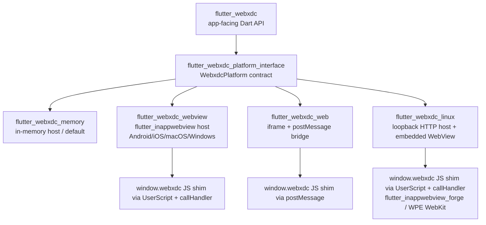

# flutter_webxdc — Design

This document records the target architecture for `flutter_webxdc`, a Flutter
plugin implementing the [webxdc specification](https://webxdc.org/docs/spec/index.html)
for interactive, embeddable mini apps (`.xdc` archives) exchanged over
chat-like transports. It follows the guidance in `AGENTS.md`: the public Dart
API stays platform-agnostic, platform hosting is split out using the
federated-plugin pattern, and intentional spec deviations are recorded here.

This is a living design document. It is being filled in incrementally, one
delivery step at a time (see the project plan); sections not yet covered are
marked `TODO (Step N)` below.

## 1. Spec summary

The [webxdc specification](https://webxdc.org/docs/spec/index.html) defines
how mini apps are packaged, delivered, and run, and covers three areas:

1. **`.xdc` container file format** — a zip file containing a `manifest.toml`,
   an optional icon, and static web assets (HTML/JS/CSS) that make up the
   mini app.
2. **JavaScript API** (`window.webxdc`) — a minimal, stable API that all mini
   apps can rely on to send/receive status updates, request files, learn the
   local user's chat identity, and (experimentally) exchange realtime data
   with peers.
3. **Messenger implementation requirements** — how a hosting messenger (in
   our case, any Flutter app embedding this plugin) must run mini apps inside
   an isolated web view, deliver `sendUpdate` payloads to peers, and persist
   per-app state across restarts.

`flutter_webxdc` implements areas (1) and (2) as a reusable Flutter
plugin, and provides the primitives a host application needs to fulfil area
(3) — see [§4 Update/sync model](#4-updatesync-model-plugin-vs-host-boundary)
for the precise boundary.

## 2. Target federated package layout

Per `AGENTS.md`, once the implementation grows beyond a single-file skeleton
we adopt the **federated plugin pattern** instead of branching on platform
inside shared code. The agreed target layout (single Git repo, melos-style
workspace) is:



| Package                            | Responsibility                                                                                                                                   |
| ----------------------------------- | -------------------------------------------------------------------------------------------------------------------------------------------------|
| `flutter_webxdc`                    | App-facing Dart API: `WebxdcSession`/`FlutterWebxdc`, `WebxdcManifest` parsing, `.xdc` zip reading, `WebxdcController`. Platform-agnostic. |
| `flutter_webxdc_platform_interface` | Abstract `WebxdcPlatform` contract (method-channel/JS message shapes), `WebxdcUpdate` model, JS-bridge event types. No platform code.               |
| `flutter_webxdc_memory`             | **Implemented.** In-memory `WebxdcPlatform` used as the default/test backend (no WebView/browser). Reference structure for native/Web packages. |
| `flutter_webxdc_webview`            | **Implemented.** Single native `flutter_inappwebview`-based `WebxdcPlatform`, registered as the `default_package` for Android, iOS, macOS, and Windows. Hosts each `.xdc` app's extracted files on a per-instance loopback `HttpServer`, injects `window.webxdc` via a `UserScript`, and bridges JS calls through `addJavaScriptHandler`/`callHandler`. |
| `flutter_webxdc_web`                | **Implemented initial host.** Hosts `.xdc` assets in a sandboxed `srcdoc` `<iframe>`, injects `window.webxdc`, and bridges it via nonce-bound JSON `postMessage`; see the current limitations below. |
| `flutter_webxdc_linux`              | **Implemented.** Registered as the `default_package` for `linux`. Hosts `.xdc` assets over the same shared loopback `HttpServer`/CSP contract as `flutter_webxdc_webview`, and renders each app in a real, embedded, JS-bridged WebView using `flutter_inappwebview_forge` (a drop-in-API-compatible fork of `flutter_inappwebview` with a native Linux/WPE WebKit backend), injecting `window.webxdc` and bridging JS calls exactly like `flutter_webxdc_webview` does. |

**Note on current repository state:** the federated package **split is
underway**. Six independently-`pub get`-able packages exist in this
repository (path dependencies stand in for what would be separate pub.dev
releases / melos-managed versions once published):

- `flutter_webxdc` (repository root) — the app-facing package.
  `WebxdcManifest` and `WebxdcArchive` (manifest parsing, `.xdc` zip
  reading, see §2.2/§2.3), `WebxdcController` (the update log/replay API,
  see §4/§2.4), and the session glue that wires those to a registered
  `WebxdcPlatform` (`WebxdcSession`, `FlutterWebxdc.ensureInitialized`)
  live here in `lib/src/`. Its `flutter: plugin:` metadata now selects
  `flutter_webxdc_web` as the Web `default_package`, so Flutter's generated
  Web registrant installs that backend before the memory fallback is needed.
- `flutter_webxdc_platform_interface` (`flutter_webxdc_platform_interface/`
  at the repo root) — the stable Dart contract per-platform packages must
  implement. It contains `WebxdcUpdate`, `WebxdcImportedFile`, the JS→host
  event types (`WebxdcJsSendUpdateEvent`, `WebxdcJsSendToChatEvent`), and
  the abstract `WebxdcPlatform` class (built on
  `package:plugin_platform_interface`, following the same
  `PlatformInterface` + static `instance` pattern used by other federated
  Flutter plugins). `flutter_webxdc` re-exports these from
  `lib/flutter_webxdc.dart`, so most consumers only need to depend on the
  root package. See §2.1a below for what `WebxdcPlatform` currently
  declares.
- `flutter_webxdc_memory` (`flutter_webxdc_memory/` at the repo root) — the
  **first concrete `WebxdcPlatform` implementation**. Hosts `.xdc` file
  trees and the update/`sendToChat`/`importFiles` bridge entirely in
  process memory (no WebView, iframe, or browser), emits on
  `sendUpdateEvents` / `sendToChatEvents`, and registers via
  `MemoryWebxdcPlatform.registerWith()`. `FlutterWebxdc.ensureInitialized()`
  auto-installs it when nothing else is registered, so the full root →
  interface → platform path is exercisable under plain `flutter test`.
   Future native packages should mirror this package's structure.
- `flutter_webxdc_web` (`flutter_webxdc_web/` at the repo root) — an
  **implemented initial browser host**. It creates a sandboxed `srcdoc`
  iframe per app, translates archive assets into `data:` URLs, injects the
  `window.webxdc` shim, and verifies both `MessageEvent.source` and a random
  per-instance token before accepting JSON `postMessage` traffic. It emits
  `sendUpdateEvents`/`sendToChatEvents`, replays updates after the iframe
  signals ready, uses the browser picker for `importFiles`, and implements the
  shared `buildHostWidget(instanceId)` contract via `HtmlElementView` so hosts
  can render a session without a backend-specific cast. `attachToElement()` and
  `iframeFor()` remain lower-level browser-only escape hatches.
- `flutter_webxdc_webview` (`flutter_webxdc_webview/` at the repo root) — an
  **implemented native `flutter_inappwebview` host**, registered as the
  root package's `default_package` for `android`, `ios`, `macos`, and
  `windows`. For each `loadApp` call it starts a per-instance loopback
  `HttpServer` (`WebxdcServer`, a backward-compatible alias for the shared
  `WebxdcLocalServer` described below) that serves the extracted `.xdc`
  file tree over `http://127.0.0.1:<port>/`, rewriting `/` to `index.html`
  and attaching a `Content-Security-Policy` header on every response
  (`WebxdcLocalServer.buildContentSecurityPolicy`) that blocks external
  `connect-src`/`img-src`/`media-src`/`frame-src` by default and widens
  them to allow `https:`/`wss:` origins when `request_internet_access` is
  `true` (see [§3](#3-sandboxing--security-requirements)). It injects
  `window.webxdc` via an `AT_DOCUMENT_START` `UserScript`, bridges
  `sendUpdate`/`setUpdateListener`/`sendToChat`/`importFiles` through
  `addJavaScriptHandler`/`callHandler`, queues updates until the
  `InAppWebViewController` exists, and implements the shared
  `buildHostWidget(instanceId)` contract while keeping
  `buildWebView(instanceId)` as a package-specific escape hatch.
- `flutter_webxdc_linux` (`flutter_webxdc_linux/` at the repo root) — an
  **implemented Linux host with a real, embedded, JS-bridged WebView**,
  registered as the root package's `default_package` for `linux`. The
  official `flutter_inappwebview` package only gained Linux support in a
  `6.2.0`-series prerelease/beta, too unstable an API surface to adopt
  here; instead this package depends on
  [`flutter_inappwebview_forge`](https://pub.dev/packages/flutter_inappwebview_forge)
  (`^2.1.77`), a drop-in-API-compatible fork whose platform-interface
  package exposes the exact same class names/JS bridge global used by the
  native bridge code below (`InAppWebView`, `InAppWebViewController`,
  `UserScript`, `window.flutter_inappwebview.callHandler`, …), and whose
  `flutter_inappwebview_forge_linux` (`1.0.8`) backend is a real native
  C++ Linux plugin built on WPE WebKit. `loadApp` starts the **same
  shared `WebxdcLocalServer`** (extracted into
  `flutter_webxdc_platform_interface` so both this package and
  `flutter_webxdc_webview` reuse one implementation instead of
  duplicating the loopback-HTTP-host/CSP logic) to serve the extracted
  `.xdc` tree with the identical network-isolation contract as the other
  native hosts, and `buildHostWidget(instanceId)`/`buildWebView(instanceId)`
  mirror `flutter_webxdc_webview`'s `WebviewWebxdcPlatform` almost
  line-for-line: they inject `window.webxdc` via an `AT_DOCUMENT_START`
  `UserScript`, bridge `sendUpdate`/`setUpdateListener`/`sendToChat`/
  `importFiles` through `addJavaScriptHandler`/`callHandler`/
  `evaluateJavascript`, and queue updates until the
  `InAppWebViewController` exists. `importFiles` uses a real, injectable
  file picker backed by `file_selector` by default (previously always
  returned an empty list). **System dependency:** actually building/
  running this package on Linux requires the WPE WebKit runtime and dev
  packages to be installed — `flutter_inappwebview_forge_linux`'s native
  `linux/CMakeLists.txt` locates them via `pkg-config`:
  `wpe-webkit-2.0` (falling back to `wpe-webkit-1.1`/`wpe-webkit-1.0`),
  `wpe-platform-2.0` (falling back to `wpebackend-fdo-1.0`), `libwpe-1.0`,
  `epoxy`, and `gtk+-3.0`. **These packages are not installed in this
  repository's sandboxed development environment, so `flutter build
  linux` could not be verified here** — only `flutter pub get`,
  `dart format`, `flutter analyze`, and `flutter test` (VM-level Dart
  tests) were run for this package; see the known-limitations note below
  for the honest disclosure of this gap.

**Known limitations of `flutter_webxdc_webview`** (tracked as follow-up
work, not yet fully implemented): the native runtime path is still validated
in this repository only by VM-level tests rather than device/emulator runs;
`buildWebView` remains a package-specific escape hatch even though ordinary
hosts can now render through the shared `buildHostWidget(instanceId)` API; and
embedding apps may still need platform-specific file-picker entitlements (for
example macOS user-selected file access). Updates that arrive before
`onWebViewCreated` has run (i.e. before the `InAppWebViewController` exists)
are now queued instead of being dropped.

**Known limitations of `flutter_webxdc_linux`:** the native `flutter_inappwebview_forge_linux`/WPE
WebKit runtime path is validated in this repository only by VM-level Dart
tests (real `HttpServer`/`HttpClient` over loopback sockets, plus a
widget-construction test that registers a minimal fake
`InAppWebViewPlatform` so the real `InAppWebView` widget can be
constructed without a native WPE WebKit engine present) rather than a
real Linux desktop/device run or `flutter build linux` — this sandbox
does not have the system WPE WebKit dev packages installed (see above),
so the actual native compilation and rendering path is **unverified** and
is the primary open item for anyone picking this package up on a real
Linux machine. `flutter_inappwebview_forge` is also a third-party fork
rather than the official `flutter_inappwebview` package (chosen
deliberately over that package's `6.2.0`-series prerelease/beta for API
stability — see the WebView technology decision section below), so its
own maintenance trajectory is a dependency risk worth tracking
independently of upstream `flutter_inappwebview`.

### WebView technology decision: `flutter_inappwebview` (and `flutter_inappwebview_forge` on Linux)

We choose [`flutter_inappwebview`](https://pub.dev/packages/flutter_inappwebview)
over `webview_flutter` plus assorted desktop add-ons because it:

- exposes a single, consistent JS-bridge API (`addJavaScriptHandler` /
  `evaluateJavascript`) across Android, Windows, and macOS (and iOS) — this
  is exactly what's needed to inject `window.webxdc` and intercept
  `sendUpdate`/`importFiles` calls uniformly across those platforms via a
  single `flutter_webxdc_webview` package;
- supports the content-security and isolation controls (custom URL schemes,
  disabling arbitrary network access, restricting navigation) needed to
  enforce the sandboxing requirements in [§3](#3-sandboxing--security-requirements).

**Linux is a special case.** The official `flutter_inappwebview` package's
Linux support only exists in a `6.2.0`-series prerelease/beta, which we
considered too API-unstable to adopt as the primary dependency for
`flutter_webxdc_linux`. We evaluated three options: (a) keep the
browser-fallback-only approach the package originally shipped with, (b) a
hybrid approach that tries an embedded WebView with a browser fallback, or
(c) adopt [`flutter_inappwebview_forge`](https://pub.dev/packages/flutter_inappwebview_forge),
a community fork of `flutter_inappwebview` that is drop-in-API-compatible
(same class names, same injected `window.flutter_inappwebview` JS bridge
global) and ships a real native Linux backend
(`flutter_inappwebview_forge_linux`) built on WPE WebKit. We chose (c):
it lets `flutter_webxdc_linux` mirror `flutter_webxdc_webview`'s bridge
code almost line-for-line instead of maintaining a second, weaker
render/bridging strategy, at the cost of depending on a third-party fork
and a Linux-specific system dependency (the WPE WebKit runtime/dev
packages — see the repository-state note above for the exact pkg-config
module names) that must be installed on the build machine.

Flutter Web cannot embed a native WebView at all, so `flutter_webxdc_web`
uses a sandboxed `<iframe>` with a `postMessage`-based bridge instead (see
[§3](#3-sandboxing--security-requirements) for why its sandboxing is weaker).

### 2.1 JS API contract (`window.webxdc`)

The table below is the implementable contract between the mini app's JS and
the Dart platform-interface layer. "Direction" is from the mini app's point
of view: **JS→Dart** means the mini app calls into the plugin (which may in
turn call the host app); **Dart→JS** means the plugin/host supplies a value
that is injected into `window.webxdc` for the mini app to read.

| Member | Direction | Signature / payload shape | Notes |
| ------ | --------- | -------------------------- | ----- |
| `sendUpdate(update, descr)` | JS→Dart | `update: { payload: JSONValue, info?: string, document?: string, summary?: string, href?: string, notify?: { [addr: string]: string } }`, `descr: string` (deprecated fallback used as `info`/chat-message text on older messengers) | `payload` MUST be JSON-serializable (no `undefined`, no binary buffers — base64-encode files). `notify` maps user addresses to notification text; the special `"*"` key is used as a catch-all when `selfAddr` is not present. `info` is truncated to ~50 chars, `document` to ~20 chars, both must not contain line breaks. Rate/size-limited by `sendUpdateInterval`/`sendUpdateMaxSize` below. Forwarded verbatim to the host app (see [§4](#4-updatesync-model-plugin-vs-host-boundary)). |
| `setUpdateListener(callback, serial)` | JS registers, Dart→JS delivers | `callback: (update: WebxdcUpdate) => void`, `serial: number` (defaults to `0`) | Delivers every update with a serial greater than the given one, including updates sent by the local instance itself, replayed in order. Returns a `Promise<void>` that resolves once the backlog known at call time has been delivered. Calling it more than once is undefined behavior (only the last registration must be honored, matching upstream implementations). |
| `sendUpdateInterval` | Dart→JS (property) | `number` (milliseconds) | Minimum time the mini app should wait between `sendUpdate()` calls; default `10000` if the host doesn't override it. Advisory — the platform layer may coalesce/delay updates sent faster than this. |
| `sendUpdateMaxSize` | Dart→JS (property) | `number` (bytes) | Maximum serialized size of a single `update` object; default `128000`. The plugin should reject/report oversized `sendUpdate` calls rather than silently truncating. |
| `sendToChat(payload)` | JS→Dart | `payload: { file?: { name: string, blob: Blob /* base64 over the bridge */ , contentType?: string }, text?: string }` (at least one of `file`/`text` required) | Opens the host chat's compose/share UI pre-filled with the given file/text so the user can forward it as a regular chat message (distinct from `sendUpdate`, which is peer-sync data). Returns a `Promise<void>`. |
| `importFiles(filters)` | JS→Dart | `filters: { extensions?: string[], mimeTypes?: string[], multiple?: boolean }` → returns `Promise<File[]>` | Triggers the platform's native file picker; `multiple` defaults to `false`. Selected files are read back into the sandbox as `File` objects — no direct filesystem access is exposed. |
| `selfAddr` | Dart→JS (property) | `string` | Opaque, host-supplied pseudonymous address identifying the local user *within this chat*; not necessarily the user's real chat address. Supplied per app instance by the host application (see [§4](#4-updatesync-model-plugin-vs-host-boundary)). |
| `selfName` | Dart→JS (property) | `string` | Host-supplied display name for the local user; hosts that don't track a name should provide `"unknown"` rather than omitting the property. |
| `joinRealtimeChannel()` *(experimental)* | JS→Dart | Returns a `realtimeChannel` object: `{ setListener(cb: (data: Uint8Array) => void): void, send(data: Uint8Array): void, leave(): void }` | Optional/feature-detected (`window.webxdc.joinRealtimeChannel !== undefined`); see [§6](#6-open-questions--limitations). `send()` payloads are capped at `128000` bytes and MUST be `Uint8Array`; data is ephemeral (not persisted/replayed like `sendUpdate`). |

`webxdc.js` itself (the script that defines `window.webxdc`) is injected by
the **host messenger**, never bundled inside the `.xdc` file — each platform
package (`flutter_webxdc_webview`, `flutter_webxdc_web`, …) is responsible
for injecting an equivalent shim that forwards these calls to the
`WebxdcPlatform` contract in `flutter_webxdc_platform_interface`.

### 2.1a `WebxdcPlatform`: the platform-implementation contract

**Implemented** (scaffolding only) in
`flutter_webxdc_platform_interface/lib/src/webxdc_platform.dart` as
`WebxdcPlatform`, an abstract class extending `PlatformInterface` (from
`package:plugin_platform_interface`) that fixes the Dart-side shape every
per-platform package must conform to, mirroring the table above one level
down (host-facing rather than JS-facing):

- `loadApp({instanceId, files, selfAddr, selfName, requestInternetAccess})`
  — host the already-extracted `.xdc` file tree for `sendUpdate`'s `#3`
  sandboxing requirements and inject the `window.webxdc` shim.
- `deliverUpdateToApp(instanceId, WebxdcUpdate update)` — forward a
  recorded update (local or peer-originated, see `WebxdcController` in
  §2.4) into the hosted app's `setUpdateListener`.
- `sendToChat({instanceId, text, fileBytes, fileName, contentType})` and
  `importFiles({instanceId, extensions, mimeTypes, multiple})` — the
  `sendToChat`/`importFiles` JS calls (`importFiles` returns
  `List<WebxdcImportedFile>`, a bytes-only file model with no filesystem
  path, per §3's "no direct filesystem access" requirement).
- `buildHostWidget(instanceId)` — return the Flutter widget that renders the
  hosted app for that instance (`HtmlElementView` on Web,
  `InAppWebView`-backed widget on native, placeholder for the memory backend).
- `supportsRealtimeChannel` — defaults to `false`; feature-detection point
  for the experimental `joinRealtimeChannel` API (§6).
- `disposeApp(instanceId)` — releases per-instance resources.

Every method's default body throws `UnimplementedError`, and
`WebxdcPlatform.instance` throws a `StateError` until some platform package
calls `WebxdcPlatform.instance = ...` (matching the `PlatformInterface`
pattern used by e.g. `shared_preferences_platform_interface`). Four
concrete implementations now exist: `MemoryWebxdcPlatform`
(`flutter_webxdc_memory`), `WebWebxdcPlatform` (`flutter_webxdc_web`),
`WebviewWebxdcPlatform` (`flutter_webxdc_webview`, the native
`flutter_inappwebview` host), and `LinuxWebxdcPlatform`
(`flutter_webxdc_linux`, the loopback-HTTP + embedded
`flutter_inappwebview_forge` host); see the repository-state note above.
All four override the JS→host event
streams and implement `buildHostWidget(instanceId)`. The method signatures
above remain a first-draft contract and may still change — for example,
`WebviewWebxdcPlatform.buildWebView(instanceId)` (a lower-level escape
hatch some hosts may want direct access to) is package-specific rather
than part of this shared interface — so treat them as scaffolding, not a
frozen ABI.

In addition to the methods above, `WebxdcPlatform` exposes two broadcast
streams that platform implementations emit when mini-app JS calls into the
bridge (so the host / `WebxdcSession` can react without polling):

- `Stream<WebxdcJsSendUpdateEvent> sendUpdateEvents` — JS called
  `sendUpdate(update, descr)`. Defaults to an empty stream.
- `Stream<WebxdcJsSendToChatEvent> sendToChatEvents` — JS called
  `sendToChat(payload)`. Defaults to an empty stream.

`WebxdcSession` (root package) is the app-facing glue that binds a
`WebxdcController` + `WebxdcArchive` to whatever `WebxdcPlatform` is
registered: it calls `loadApp` on open, forwards every controller update
into `deliverUpdateToApp`, records JS-originated `sendUpdateEvents` back
into the controller, and calls `disposeApp` on dispose.

### 2.2 `manifest.toml` schema and `WebxdcManifest` data model

Per the upstream `.xdc` format page, `index.html` is the one mandatory
entry point; `manifest.toml` at the archive root is **optional** (an
earlier revision of this document said the opposite — that wording has
been corrected to match both upstream and the `WebxdcArchive` reader in
[§2.3](#23-xdc-zip-container-reader)). When present, `manifest.toml` is
parsed against the following schema, plus the plugin-level
`*_api_version` fields the platform interface will use for its own
capability negotiation (see the caveat below the table):

| Field | Type | Required | Default | Notes |
| ----- | ---- | -------- | ------- | ----- |
| `name` | string | **required** | — | Display name of the mini app, shown next to its icon. |
| `source_code_url` | string | optional | `null` | URL to the app's source code, surfaced by hosts as a "view source" link. |
| `request_internet_access` | boolean | optional | `false` | If `true`, the web view/iframe is allowed outgoing network access (see [§3](#3-sandboxing--security-requirements)); if absent or `false`, all network requests MUST be blocked. |
| `min_api_version` | integer | optional | `null` | *Plugin-level, forward-looking field* (see caveat below) — lowest `WebxdcPlatform` API/capability version the app requires; hosts below this version should refuse to run the app rather than fail at runtime. |
| `max_api_version` | integer | optional | `null` | *Plugin-level, forward-looking field* (see caveat below) — highest API/capability version the app was tested against; informational only, hosts are not required to enforce it. |

> **Caveat:** as of this writing, the upstream stable webxdc spec
> (https://webxdc.org/docs/spec/index.html) only confirms `name`,
> `source_code_url`, and `request_internet_access` as documented
> `manifest.toml` fields; `min_api_version`/`max_api_version` are not present
> in the public spec pages we could verify. We still record them here (per
> this design's requirements) as an anticipated extension point for the
> `flutter_webxdc_platform_interface` capability contract (e.g. gating
> `joinRealtimeChannel` support), but implementations MUST treat them as
> optional/tolerant-parse fields and MUST NOT fail to load an `.xdc` app
> solely because they are absent — see also [§6](#6-open-questions--limitations).

**Implemented** in `lib/src/webxdc_manifest.dart` as `WebxdcManifest`, with
`WebxdcManifest.fromToml(String source)` (raw TOML text, via `package:toml`)
and `WebxdcManifest.fromMap(Map<String, dynamic> toml)` (already-decoded
map) constructors. Both tolerate missing optional fields per the table
above and throw `FormatException` if `name` is missing/empty/non-string, if
the TOML itself is malformed, or if a present optional field has the wrong
type (see `test/flutter_webxdc_test.dart`):

```dart
/// Parsed representation of a `.xdc` app's `manifest.toml`.
class WebxdcManifest {
  const WebxdcManifest({
    required this.name,
    this.sourceCodeUrl,
    this.requestInternetAccess = false,
    this.minApiVersion,
    this.maxApiVersion,
  });

  /// Required. Display name of the mini app.
  final String name;

  /// Optional. URL to the app's source code.
  final String? sourceCodeUrl;

  /// Optional, defaults to `false`. Whether the app may perform outgoing
  /// network requests from its web view/iframe.
  final bool requestInternetAccess;

  /// Optional. Lowest platform-interface API version required by the app.
  final int? minApiVersion;

  /// Optional. Highest platform-interface API version the app was tested
  /// against.
  final int? maxApiVersion;
}
```

### 2.3 `.xdc` zip container reader

**Implemented** in `lib/src/webxdc_archive.dart` as `WebxdcArchive`, a
read-only, in-memory reader (`archive` package's `ZipDecoder`) with:

- **zip-slip / path-traversal protection**: entry names are normalized
  (leading `./`/`/` stripped) and rejected with a `FormatException` if they
  contain a `..` segment, a backslash, or a Windows drive-letter prefix,
  before any bytes are exposed to callers — see [§3](#3-sandboxing--security-requirements).
- **`index.html` is mandatory**; a missing entry throws `FormatException`.
  This follows the upstream `.xdc` format page (`index.html` mandatory,
  `manifest.toml` optional) rather than this document's earlier "manifest is
  always required" wording — that wording has been corrected here.
- **`manifest.toml` is optional**: if present it is parsed via
  `WebxdcManifest.fromToml`; `WebxdcArchive.manifest` is `null` when absent,
  and a malformed manifest still throws `FormatException`.

`WebxdcArchive` exposes `filePaths`, `hasIndexHtml`, `readBytes(path)`, and
`readString(path)`; it does not write to disk or extract into a directory —
materializing assets for a web view/iframe is a per-platform-package concern
that does not exist yet. See `test/webxdc_archive_test.dart`.

### 2.4 App-facing update log/replay: `WebxdcController`

**Implemented** in `lib/src/webxdc_controller.dart` as `WebxdcController`,
the platform-agnostic half of the [§4](#4-updatesync-model-plugin-vs-host-boundary)
plugin/host boundary for a single `.xdc` app instance:

- `sendUpdate(update, {descr})` records a local mini-app update, assigns it
  the next serial, applies the `descr`→`info` fallback, enforces
  `sendUpdateMaxSize` (throwing `WebxdcUpdateTooLargeException` if
  exceeded), and emits it on the `updates` broadcast stream.
- `deliverUpdate(update)` is the host-facing counterpart: the hosting
  application calls this when it receives an update from a peer over its
  own transport, sharing the same serial sequence as `sendUpdate` so replay
  is origin-agnostic.
- `updatesSince(serial)` implements `setUpdateListener(callback, serial)`'s
  replay semantics (defaults to `0`, i.e. the full backlog).
- `selfAddr`/`selfName`/`sendUpdateInterval`/`sendUpdateMaxSize` are plain
  constructor parameters a host supplies per app instance; a future JS
  bridge would read them to populate the corresponding `window.webxdc`
  properties.

`WebxdcController` has no dependency on Flutter widgets, platform channels,
or JS interop, beyond the `WebxdcUpdate` model it shares with
`flutter_webxdc_platform_interface` (§2.1a) — a `WebxdcPlatform`
implementation is expected to sit on top of it, forwarding
`sendUpdate`/`setUpdateListener` calls from mini-app JS into this
controller (via `deliverUpdateToApp`) and vice versa. See
`test/webxdc_controller_test.dart`.

## 3. Sandboxing / security requirements

Every hosting platform implementation MUST enforce the following, per the
webxdc "messenger implementation" requirements:

- **No network access by default.** `.xdc` content is loaded from local
  bundled/extracted assets (never a live network URL), and outgoing network
  requests from the web view are blocked unless the manifest sets
  `request_internet_access = true` (see the [`manifest.toml` schema](#22-manifesttoml-schema-and-webxdcmanifest-data-model)).
  On the native `flutter_inappwebview` host (`flutter_webxdc_webview`) this
  is enforced by a `Content-Security-Policy` response header
  (`WebxdcServer.buildContentSecurityPolicy`) attached to every asset
  served by its per-instance loopback `HttpServer`: `connect-src`/
  `img-src`/`media-src`/`frame-src` are restricted to `'self'` plus local
  `data:`/`blob:` URIs by default, and widened to `https:`/`wss:` only when
  `request_internet_access = true`. On Web it is enforced via the iframe's
  `Content-Security-Policy` (`connect-src 'none'` unless internet access is
  granted) and `sandbox` attribute.
- **Isolated storage per chat/app.** Each `.xdc` instance's persisted state
  (its own `localStorage`/IndexedDB-equivalent, cached update payloads) is
  scoped per chat-message + app identity, never shared between different
  `.xdc` instances or different chats. On native platforms this maps to a
  dedicated `flutter_inappwebview` data directory / cookie-manager instance
  per app; on Web it maps to a same-origin-isolated iframe (e.g. a unique
  `sandbox` origin per app instance) so `postMessage` traffic and storage
  cannot leak across app instances.
- **No access to the hosting app's own data or other `.xdc` apps.** The web
  view/iframe only receives the JS-bridge surface described in the
  [JS API contract](#21-js-api-contract-windowwebxdc) — no direct
  method-channel or JS-interop access to unrelated host-app functionality.
- **Icon/HTML/JS assets are read-only and verified against the manifest**
  before being handed to the web view, to avoid path traversal or zip-slip
  when unpacking the `.xdc` zip.

These requirements bound what `flutter_webxdc` guarantees; anything about
*how* update payloads are transported between chat participants is outside
this boundary (see [§4](#4-updatesync-model-plugin-vs-host-boundary)).

## 4. Update/sync model: plugin vs. host boundary

`flutter_webxdc`'s responsibility ends at exposing the `window.webxdc` JS API
to the mini app and surfacing/accepting `WebxdcUpdate` payloads to/from the
embedding Flutter application:

- When mini-app JS calls `sendUpdate(update, descr)`, the plugin forwards the
  serialized `update` payload to the **host application** (e.g. via a Dart
  callback/stream exposed by `flutter_webxdc`). The plugin does **not** know
  about chat participants, network transports, or persistence beyond the
  current app instance's own update log (needed to replay updates to
  `setUpdateListener` on later opens).
- Actually delivering that update to other chat peers (e.g. over a chat
  protocol, email, or any other messenger-specific transport) is entirely the
  **hosting application's** responsibility. Likewise, when the host app
  receives an update from a peer, it is the host's responsibility to call
  back into the plugin (e.g. `WebxdcController.deliverUpdate(update)`) so the
  plugin can forward it to the mini app's `setUpdateListener` callback and
  persist it for `serial`-based replay.
- `selfAddr`/`selfName` values are supplied by the host application per
  chat/app instance (the plugin has no notion of user identity); the plugin
  only exposes them to the mini app through the JS bridge.

In short: **`flutter_webxdc` is the JS-bridge + sandboxing layer; the hosting
app is the transport + identity + persistence-across-devices layer.**

## 5. Testing strategy

Hand-written fixtures under `test/fixtures/` are used for automated validation
against the [JS API contract](#21-js-api-contract-windowwebxdc) and the
[`manifest.toml` schema](#22-manifesttoml-schema-and-webxdcmanifest-data-model).
For manual and integration verification, developers should refer to upstream
reference apps: [webxdc/hello](https://github.com/webxdc/hello), the
[webxdc store](https://store.webxdc.org/), and the [webxdc-dev tools](https://github.com/webxdc/webxdc-dev).
Platform-specific test scoping follows `AGENTS.md`.

## 6. Open questions / limitations

- **`joinRealtimeChannel` is experimental.** Per the spec
  (https://webxdc.org/docs/spec/joinRealtimeChannel.html), messengers are not
  required to implement it, and mini apps must feature-detect it via
  `window.webxdc.joinRealtimeChannel !== undefined`. Its contract is
  documented in [§2.1](#21-js-api-contract-windowwebxdc), but it is treated
  as an optional, separately versioned capability in the platform interface,
  not part of the stable `WebxdcPlatform` contract — implementations may
  leave it unsupported (feature-detected as absent) without violating the
  spec.
- **`min_api_version`/`max_api_version` are not confirmed upstream spec
  fields.** They are documented in [§2.2](#22-manifesttoml-schema-and-webxdcmanifest-data-model)
  as a forward-looking, plugin-level extension point for capability
  negotiation (e.g. gating `joinRealtimeChannel`); this should be revisited
  against the upstream spec before the manifest parser is implemented, in
  case upstream standardizes different field names for the same purpose.
- **Flutter Web sandboxing is weaker than native WebView sandboxing.** A
  browser `<iframe>` with `sandbox`/CSP attributes provides origin isolation
  and blocks navigation/top-level access, but it does not provide true
  OS-level process isolation the way a dedicated native WebView instance
  does, and CSP-based network blocking can be more brittle (e.g. some
  request types are not covered by all CSP directives in all browsers). This
  is a known, intentional deviation for the Web target and must be
   called out to host applications wanting strict security guarantees on Web.
- **The initial Web host is deliberately narrow.**
  `flutter_webxdc_web` rewrites quoted relative HTML `src`/`href` attributes
  to archive `data:` URLs and supports the stable identity/update/import APIs,
  but it does not yet virtualize CSS `url(...)`, dynamic imports, or
  service-worker asset loading. JS `sendToChat` currently forwards text
  payloads only; iframe file payload serialization remains follow-up work.
  Its DOM code uses the SDK's `dart:html` compatibility API for
  `MessageEvent`/file-picker support while the package carries `package:web`
  for the planned migration. These gaps are known Web-target deviations, not
  silent permission grants: the iframe CSP still blocks network requests when
  `request_internet_access` is false.
- **`flutter_inappwebview`'s official Linux support is still only a
  prerelease/beta** (see the repository-state note in §2), so
  `flutter_webxdc_linux` depends on `flutter_inappwebview_forge` instead —
  a third-party, drop-in-API-compatible fork — to get a real, embedded,
  JS-bridged `window.webxdc` renderer on Linux today rather than waiting
  for the official package to stabilize there. This closes the
  previously-documented "no embedded renderer on Linux" gap, but trades
  it for two new, tracked risks: (1) **the native `flutter_inappwebview_forge_linux`/WPE
  WebKit build path needed local fixes to actually work** — the published
  `1.0.8` release fails to build on Linux (see the vendoring note below);
  with those fixes applied and vendored, `flutter build linux` has been
  run successfully against the system WPE WebKit dev packages, but
  runtime/device verification of the rendered `window.webxdc` page is
  still outstanding; and (2) depending on a community fork rather than
  the upstream package is itself a maintenance-trajectory risk that
  should be revisited if/when official `flutter_inappwebview` Linux
  support stabilizes out of prerelease, at which point switching
  `flutter_webxdc_linux` back to the upstream package behind the same
  `WebxdcPlatform` contract (without changing any other package) would be
  the natural follow-up. If `flutter_inappwebview`'s coverage of the
  remaining platforms (Android/iOS/macOS/Windows) regresses further, the
  same per-platform-package escape hatch applies there too; the federated
  `platform_interface` package isolates the rest of the plugin from either
  choice.
- **`flutter_inappwebview_forge_linux` 1.0.8 is vendored locally under
  `flutter_inappwebview_forge_linux/`, overridden via `dependency_overrides`
  in both the root `pubspec.yaml` and `flutter_webxdc_linux/pubspec.yaml`.**
  The published `1.0.8` release on pub.dev fails to build after the
  package's rename from `flutter_inappwebview_linux`: `linux/CMakeLists.txt`
  still declares the pre-fork `PLUGIN_NAME`, the public header still lives
  under the pre-fork `include/flutter_inappwebview_linux/` directory (both
  mismatching what Flutter's generated CMake/registrant code expects for
  the new package name), and `linux/in_app_webview/in_app_webview.cc` calls
  two WPE WebKit functions
  (`webkit_website_data_manager_new`/`webkit_web_context_new_with_website_data_manager`)
  that do not exist in current WPE WebKit plus references a
  `content_blockersChanged` variable that is actually declared as
  `contentBlockersChanged`. The vendored copy fixes all four issues (see
  `bug-report.md` for the original report and the corresponding commits for
  the fixes) so `flutter build linux` succeeds against the system WPE
  WebKit packages. This override should be dropped once a corrected release
  ships upstream on pub.dev.
- **`flutter_webxdc_webview` is still an initial native host rather than a
  fully production-hardened one.** It now implements the shared
  `buildHostWidget(instanceId)` contract, emits/forwards `sendToChat`, uses a
  real `file_selector`-backed `importFiles`, and queues updates until the
  underlying `InAppWebViewController` exists. Remaining gaps are runtime/device
  verification of the real native WebView path in this repository, dynamic deep
  linking, and embedding-app-specific picker entitlements/configuration (for
  example macOS user-selected file access). These are tracked as follow-up
  work, not silent behavior changes to the documented contract.
- **`.xdc` size/complexity limits** (max archive size, resource limits for
  long-running mini apps) are not yet specified in this document; upstream
  Delta Chat currently caps `.xdc` files at 640 kB, but this is an
  implementation choice rather than a hard spec requirement, and this design
  leaves the plugin's own limit (if any) as a later decision, likely exposed
  as a host-app-configurable option rather than hardcoded.
- **Hosted apps are now told when their on-screen size changes, and get a
  viewport fallback.** Previously, resizing the embedding card/window (e.g.
  a host app maximizing/restoring it) only resized the native WebView/iframe
  box itself — the hosted page inside it was never told, so many mini apps
  (which size canvases/layouts once from `window.innerWidth`/`innerHeight`
  at load time and never re-measure) kept rendering for their original,
  often small, size. Two independent fixes address this:
  - `flutter_webxdc_webview` and `flutter_webxdc_linux` now wrap their
    `buildHostWidget` output in the shared
    `WebxdcSizeObserver` (`flutter_webxdc_platform_interface`), which
    dispatches a DOM `window` `resize` event inside the WebView via
    `evaluateJavascript` whenever the widget's laid-out box actually
    changes size. Their injected JS bridge also re-dispatches `resize` from
    a `ResizeObserver` on `document.documentElement`, for apps that observe
    their own layout instead of listening for `window`'s `resize` directly.
    Flutter Web's sandboxed `<iframe>` already receives a native `resize`
    event from the browser when its own box changes, so no equivalent
    wiring was needed there.
  - `WebxdcLocalServer` (serving HTML to the WebView/Linux hosts) and
    `WebxdcWebDocumentBuilder` (building the Web host's sandboxed iframe
    document) both now inject a default
    `<meta name="viewport" content="width=device-width, initial-scale=1">`
    into served/built HTML that doesn't already declare one, so the CSS
    viewport always matches the real rendered box instead of an
    engine-specific desktop-width default.
  Host applications embedding a small default card (rather than a
  maximized one) should still expect some mini apps — those that neither
  listen for `resize`/`ResizeObserver` nor use responsive CSS — to render
  for whatever size they first saw; this fix addresses the common case of
  apps that do re-measure but were never actually told to.
